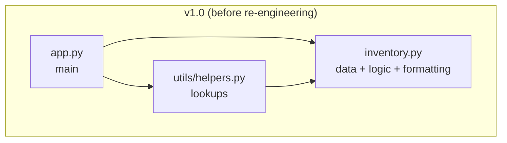
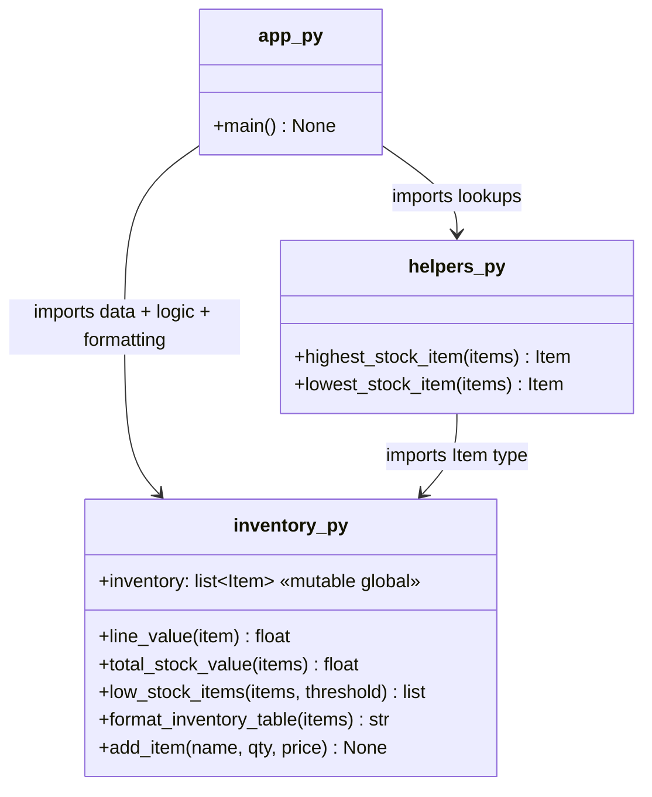
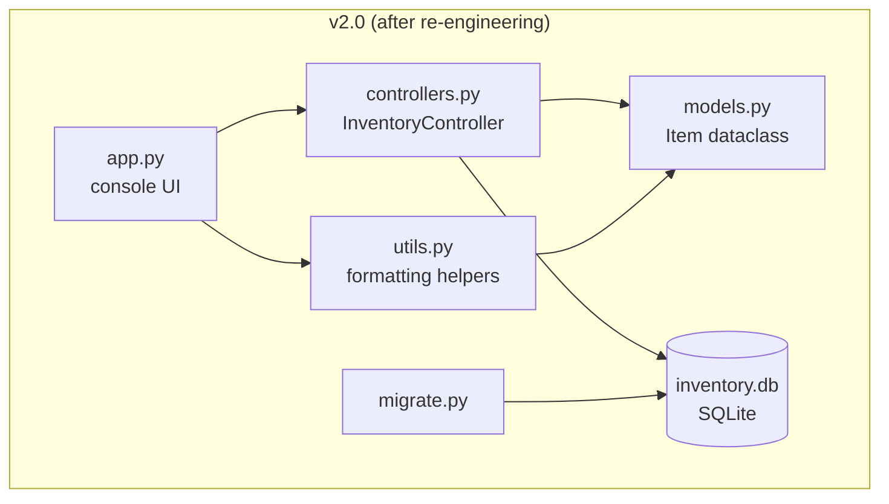

# Lab 4 — Reverse Engineering Notes (Inventory v1.0)

Analysis of the Lab 3 codebase (`v1.0`) before re-engineering.

## 1. Code Inventory

| Module | Functions | Responsibility |
|--------|-----------|----------------|
| `inventory.py` | `line_value()`, `total_stock_value()`, `low_stock_items()`, `format_inventory_table()`, `add_item()` + module-level `inventory` list | Data storage **and** business logic **and** presentation |
| `app.py` | `main()` | Console UI / orchestration |
| `utils/helpers.py` | `highest_stock_item()`, `lowest_stock_item()` | Lookup helpers |

## 2. Module Dependency Diagram

## 3. Function-Level View (UML-style)

## 4. Code Smells & High-Coupling Areas

1. **God module** — `inventory.py` mixes three concerns: data storage
   (the `inventory` list), business logic (`total_stock_value`,
   `low_stock_items`), and presentation (`format_inventory_table`).
2. **Mutable global state** — every function reads or writes the shared
   `inventory` list; nothing can be tested against a different data source,
   and the data disappears when the process exits (no persistence).
3. **Dict-shaped records** — items are loose `dict`s; a typo in a key
   (`item["pricee"]`) fails only at runtime.
4. **Circular-ish import risk** — `utils/helpers.py` imports from
   `inventory.py` just for the type alias, coupling a generic utility to the
   data module.
5. **No storage abstraction** — swapping the Python list for a database
   would require touching every module.

## 5. Re-engineering Targets

| Smell | Remedy |
|-------|--------|
| God module | Split into `models.py` (types), `controllers.py` (logic + data access), `utils.py` (presentation helpers) |
| Mutable global list | SQLite database (`inventory.db`) accessed through a repository-style controller |
| Loose dicts | `@dataclass Item` with typed fields |
| Utility coupling | `utils.py` depends only on `models.py` |
| No persistence | `migrate.py` one-time migration + `sqlite3` storage layer |

## 6. Target Architecture

